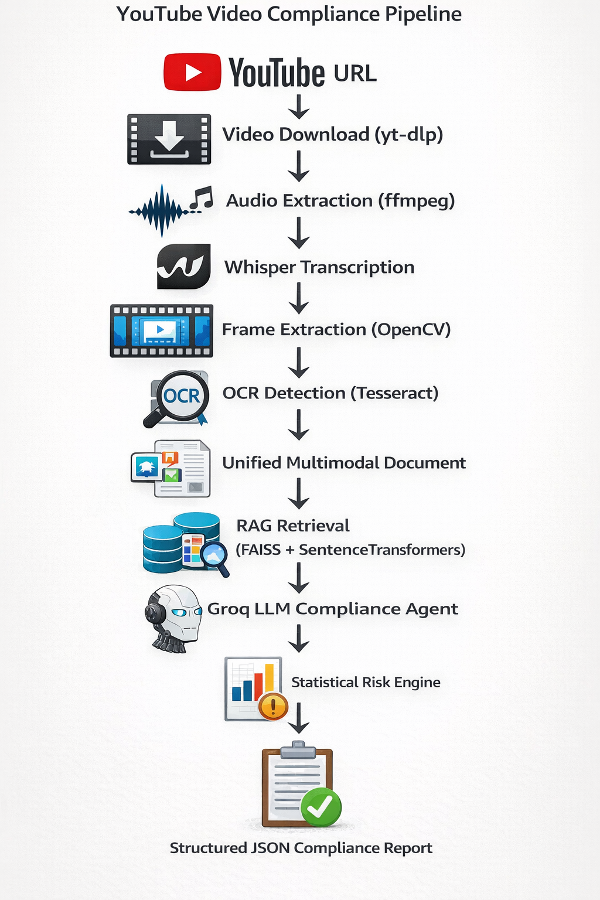

# Agentic-AI---Multimodal-YouTube-Advertisement-Compliance-Agent
An end-to-end Agentic AI system that analyzes YouTube advertisement videos for regulatory compliance using:

🎙 Speech-to-Text (Whisper) 

🖼 OCR for visual claims 

📚 RAG (Retrieval-Augmented Generation) over compliance PDFs 

🧠 Groq LLM reasoning 

📊 Statistical risk scoring 

🌐 Gradio web interface

# 📌 Objective

The goal of this project is to build a production-style AI compliance auditing system that:

1) Ingests a YouTube advertisement URL

2) Extracts spoken and visual content

3) Retrieves relevant compliance rules from regulatory PDF documents

4) Detects potential violations using a large language model

5) Computes a statistical risk score

6) Generates a structured compliance report

This simulates real-world ad monitoring systems used by:
Regulatory bodies,
Brand safety teams,
Financial/healthcare compliance departments,
Ad platforms

# 🏗 System Architecture

# 🧠 Core Components

1️⃣ Video Ingestion: 
Validates YouTube URL,
Downloads video locally,
Extracts metadata (title, channel, duration)

Tooling:
yt-dlp

2️⃣ Multimodal Extraction:

🎙 Speech-to-Text:
Extracts audio using ffmpeg,
Transcribes using Whisper (faster-whisper),
Produces timestamped transcript JSON

🖼 OCR Detection:
Extracts frames every few seconds,
Uses pytesseract to detect on-screen text,
Removes duplicates,
Produces timestamped OCR JSON

3️⃣ Unified Video Document:

Transcript + OCR + Metadata are merged into a structured document:

VIDEO TITLE

CHANNEL

DURATION

--- SPOKEN CONTENT ---
...

--- VISUAL CONTENT ---
...

This becomes the query input for RAG.

4️⃣ Compliance Knowledge Base (RAG)

Two regulatory PDF documents are used as rule sources.

Processing Steps:

Extract text from PDFs (pypdf),
Chunk into overlapping sections,
Generate embeddings (SentenceTransformers),
Store vectors in FAISS index

At runtime:

Video document is embedded,
Top-K relevant rule chunks are retrieved,
Only relevant rules are sent to the LLM,
This reduces hallucination and improves precision.

5️⃣ LLM Compliance Agent (Groq)

Uses Groq-hosted LLM:

Example model: llama-3.3-70b-versatile

The LLM:
Compares video content against retrieved rules,
Identifies violations,
Quotes evidence,
Assigns severity (Low / Medium / High),
Assigns confidence score (0–1)

6️⃣ Statistical Risk Engine

This layer converts LLM output into measurable risk.

| Severity | Weight |
| -------- | ------ |
| Low      | 0.3    |
| Medium   | 0.6    |
| High     | 0.9    |

Risk formua: 

Risk_i = SeverityWeight × Confidence

Overall Risk = average(Risk_i)

This transforms the system from an LLM demo into a decision intelligence engine.

# 🌐 Gradio Web App

A simple UI allows users to:

Paste YouTube ad link,
Run full compliance audit,
View structured JSON report.

